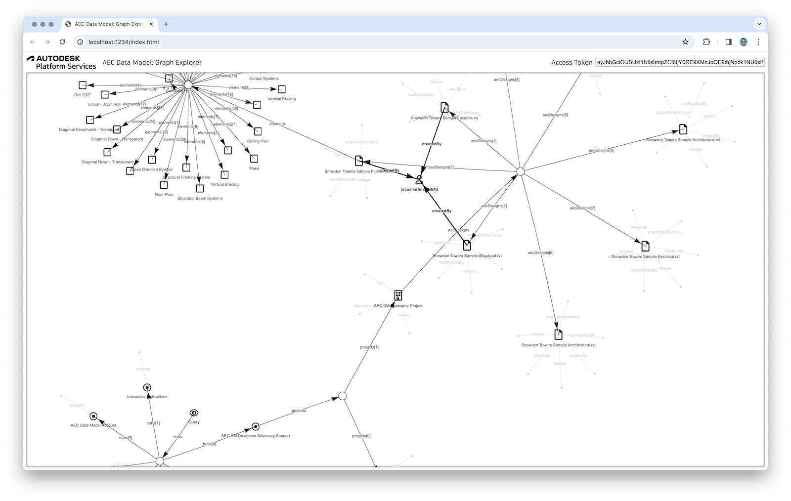

# aps-aecdm-graph-explorer

Experimental visual explorer of the [AEC Data Model](https://aps.autodesk.com/en/docs/aecdatamodel-beta/v1/developers_guide/overview/) graph,
built with [Vis.js](https://visjs.github.io/vis-network/docs/network/nodes.html).

## Live demo

- Obtain a 3-legged OAuth token with `data:read` access to an ACC hub with AEC Data Model enabled, for example:
    - Go to https://aecdatamodel-explorer.autodesk.io, and open the _Network_ tab in your browser developer tools
    - Login with your Autodesk credentials
    - Find the outgoing request to https://aecdatamodel-explorer.autodesk.io/api/auth/token in the _Network_ tab, and copy the access token from the response
- Go to https://autodesk-platform-services.github.io/aps-aecdm-graph-explorer
- Paste your token to the _Access Token_ field in the top-right corner, and hit Enter
- A simple graph should be loaded with just a single node called _Query_, and an edge called _hubs_
- Double-click on the _hubs_ edge, and it will expand into a list of all hubs available for your OAuth token
- Continue double-clicking on other edges to drill into the AEC Data Model graph